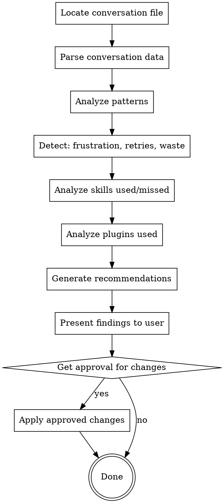

# improve-claude

## Overview

Analyze completed conversations to identify inefficiencies, frustration points, and opportunities to improve Claude's entire configuration ecosystem - CLAUDE.md, rules, skills, AND plugins. Makes Claude incrementally better with each use by learning from what went wrong and what could have been better.

## When to Use

Use when:
- Conversation involved multiple retries or "still not working" cycles
- User expressed frustration ("think more carefully", "stop trying random things")
- Task took much longer than expected
- Ran out of context and needed to summarize
- User asks to review conversation for improvements
- After completing major multi-hour tasks
- When you notice patterns you keep repeating

**Auto-suggest** after:
- 100+ conversation turns
- 3+ user expressions of frustration
- Context summary triggered
- Task marked complete after long conversation

## Core Principle

**Every frustrating conversation teaches Claude how to prevent that frustration next time.**

## Analysis Targets

### 1. User Frustration
**Detect**: "still not", "still doesn't", "think more carefully", "stop trying", "this is wrong", "why is this failing"

**Output**: Timeline of frustration with context

### 2. Retry Loops
**Detect**: Same pattern attempted 3+ times, user restart cycles without progress

**Output**: What should have been investigated earlier

### 3. Context Waste
**Detect**: Reading same files multiple times, broad searches, trial-and-error without investigation

**Output**: How to be more surgical next time

### 4. Missing Investigation
**Detect**: User had to say "research online", "think harder", gaps in systematic comparison

**Output**: Investigation checklist that was missing

### 5. Tool Approval Friction
**Detect**: Repeated permission requests for similar operations

**Output**: Whether tool auto-approval rules need updating

### 6. Workflow Inefficiencies
**Detect**: Long conversations, multiple context summaries, stuck points

**Output**: Workflow improvements (exploration, planning, verification)

### 7. Skill Gaps and Improvements
**Detect**:
- Skills that were invoked but didn't prevent the problem
- Skills that SHOULD have been invoked but weren't
- Skill descriptions that didn't trigger when they should have
- Missing skills that would have helped

**Output**:
- Existing skill improvements (better descriptions, missing sections, unclear workflows)
- New skills to create
- Skill invocation triggers that need updating

### 8. Plugin Gaps and Improvements
**Detect**:
- Plugins that were used but could be more effective
- Missing plugin features that would have helped
- Plugin workflows that were confusing or inefficient
- Commands that should exist but don't

**Output**:
- Existing plugin improvements (new commands, better defaults, clearer docs)
- New plugins to create
- Plugin integration issues

## Workflow



### Phase 1: Locate Conversation

Conversation files: `~/.claude/projects/[cwd-escaped]/[sessionId].jsonl`

Most recent: `ls -lt ~/.claude/projects/[cwd]/*.jsonl | head -1`

Current session ID: Available in environment or from latest file

### Phase 2: Parse Conversation

**Primary: Use claude-historian-mcp**

Search conversation for patterns using the installed claude-historian-mcp server:

```bash
# Search for frustration patterns
mcp__plugin_claude-historian_mcp_search_conversations \
  --query "still not OR still doesn't OR think more carefully OR stop trying"

# Search for skill invocations
mcp__plugin_claude-historian_mcp_search_conversations \
  --query "using skill OR invoke skill"

# Search for restart cycles
mcp__plugin_claude-historian_mcp_search_conversations \
  --query "restarted claude OR restart"
```

**Fallback: Direct .jsonl parsing**

If you need specific metrics not available via claude-historian:

```bash
# Locate conversation file
CONV_FILE=~/.claude/projects/-Users-v--claude/[sessionId].jsonl

# Count turns
wc -l "$CONV_FILE"

# Find high token usage
jq 'select(.message.usage.input_tokens > 10000) | {timestamp, tokens: .message.usage.input_tokens}' "$CONV_FILE"

# Extract user messages for manual review
jq 'select(.type == "user") | {timestamp, content: .message.content[0].text}' "$CONV_FILE"
```

**What to extract:**
- User frustration indicators and timestamps
- Retry loop patterns
- Skill invocations (which skills, when)
- Tool/command usage patterns
- Token usage metrics
- Context summary occurrences

### Phase 3: Analyze Patterns

**Frustration detection** (case-insensitive):
- "still not" / "still doesn't" / "still failing"
- "this is wrong" / "this doesn't work"
- "think more carefully" / "think harder"
- "stop trying random things"
- "research online" / "investigate"
- "why is this failing" / "why isn't this working"

**Retry loop detection**:
- Same error pattern 3+ times
- User restart cycles (user says "restarted", then "still not working")
- Similar approaches attempted repeatedly

**Context waste detection**:
- Total turns > 500 (likely inefficient)
- Context summaries triggered (conversation continued)
- Same files read 3+ times
- Broad searches (>50 results) without filtering

**Missing investigation indicators**:
- User says "research online" (we should have done this earlier)
- User says "think more carefully" (approach was too shallow)
- User says "compare" (should have compared sooner)
- Root cause found late in conversation

### Phase 3a: Analyze Skills Used/Missed

**Check conversation for skill invocations:**
```bash
grep -i "skill:" conversation.jsonl
grep -i "using.*skill" conversation.jsonl
```

**For each skill that WAS invoked:**
1. Did it prevent the problem it's designed to prevent?
2. Was the skill description accurate for triggering?
3. Did the workflow in the skill get followed?
4. Were there gaps in the skill content?
5. Did user frustration happen AFTER using the skill?

**For skills that SHOULD have been invoked but weren't:**
1. What task pattern matches a known skill?
2. Why didn't the skill trigger? (description too vague? wrong keywords?)
3. Would the skill have prevented the issue?

**Skill improvement recommendations:**

| Type | Example | Action |
|------|---------|--------|
| Description gap | Skill applies but didn't trigger | Update description with better keywords/triggers |
| Content gap | Skill triggered but didn't help | Add missing section to SKILL.md |
| Workflow unclear | Skill used incorrectly | Clarify workflow with flowchart/checklist |
| Missing skill | Pattern repeats with no skill | Create new skill |

**Check existing skills:**
- `~/.claude/skills/` (personal skills)
- `~/.claude/plugins/marketplaces/custom/plugins/*/skills/` (custom marketplace)
- `~/.claude/plugins/cache/*/skills/` (installed marketplace skills)

### Phase 3b: Analyze Plugins Used

**Check conversation for plugin/command usage:**
```bash
grep "commands/" conversation.jsonl
grep "plugin.*used" conversation.jsonl
```

**For each plugin that WAS used:**
1. Did the command work smoothly or cause friction?
2. Were there missing options/flags that would have helped?
3. Did the command output need better formatting?
4. Should there be a related command for the next step?

**For plugins that COULD have been used:**
1. What manual work was done that a command could automate?
2. What pattern repeated that should be a slash command?
3. What workflow would benefit from automation?

**Plugin improvement recommendations:**

| Type | Example | Action |
|------|---------|--------|
| Missing command | Manual work repeated 3+ times | Create new command |
| Missing flag | Had to run command multiple times with variations | Add option to existing command |
| Poor UX | Command caused confusion | Improve command description/help |
| Missing integration | Two commands used sequentially | Combine into workflow command |

**Check existing plugins:**
- `~/.claude/plugins/marketplaces/custom/plugins/` (custom plugins)
- Plugin list: `claude plugins list`

### Phase 4: Generate Recommendations

For each pattern, suggest specific improvements across the entire Claude ecosystem:

**CLAUDE.md additions**:
- New "when stuck" protocols
- Investigation checklists
- Verification requirements
- Skill usage reminders

**Rules updates**:
- New anti-patterns discovered
- Workflow improvements
- Tool usage guidance
- Context efficiency patterns

**Skills to improve**:
- Better trigger descriptions (keywords that match actual usage)
- Missing workflow sections
- Clearer examples
- Better cross-references

**Skills to create**:
- Systematic investigation patterns
- Retry loop detection
- Evidence-based verification
- Automation opportunities identified

**Plugins to improve**:
- New commands for repeated manual work
- Better command descriptions
- Additional flags/options
- Integration improvements

**Plugins to create**:
- Workflow automation
- Development tooling gaps
- Integration needs

**Provide for EACH recommendation**:
- Exact file paths (ready to edit)
- Concrete text to add (formatted, ready to paste)
- Rationale (why this prevents the problem)
- Priority (high/medium/low based on impact)

### Phase 5: Present Findings

Format:
```markdown
# Conversation Analysis: <session-slug>

## Summary
- Duration: <hours>
- Total turns: <count>
- Context summaries: <count>
- User frustration events: <count>

## Key Issues

### 1. <Issue Type>
**What happened**: <specific instance>
**Why it matters**: <impact>
**How to prevent**: <specific change>

## Recommendations

### CLAUDE.md
<file>: Add at line <N>:
```
<exact text>
```

### Rules
<file>: Add section:
```
<exact text>
```

## Questions
- <any clarifications needed>
```

### Phase 6: Get Approval

**NEVER auto-apply changes**. Present ALL recommendations and ask:
"Which improvements should I apply?"

User can:
- Accept all
- Select specific ones
- Modify suggestions
- Reject and explain why

### Phase 7: Apply Changes

Only apply approved changes. Use Edit tool for modifications, verify each change.

## Common Patterns to Detect

| Pattern | Example | Suggestion |
|---------|---------|------------|
| Trial-and-error | 3+ attempts without investigation | Add investigation-first rule |
| Premature "should work" | Claims success before verification | Add verification requirement |
| Shallow comparison | Missed key differences | Add comprehensive comparison checklist |
| Context explosion | >1000 turns, multiple summaries | Add investigation-before-coding rule |
| Tool friction | Many approval requests | Review auto-approval rules |

## Red Flags

If you find yourself:
- Analyzing without parsing the actual conversation file → Load and parse first
- Suggesting vague improvements → Be specific with file:line and exact text
- Auto-applying changes → STOP, get approval first
- Missing user frustration points → Search for key phrases
- Ignoring context summaries → These indicate major inefficiency

## Token Efficiency

**Minimize context usage:**
- Use `conversation-analyzer.js` to extract just relevant data
- Don't load entire conversation into context
- Summarize findings, don't quote extensively
- Focus on actionable improvements, not narrative
- One comprehensive analysis better than multiple partial ones

## Success Metrics

**Good analysis includes:**
- Specific frustration timeline with timestamps
- Concrete retry loops identified (not vague)
- Actionable recommendations with file paths
- Ready-to-paste text for improvements
- User approval before any changes

**Avoid:**
- Vague observations ("could be better")
- Generic advice ("try harder next time")
- Changes without user approval
- Missing the actual patterns
- Over-quoting conversation

## Example Output Structure

```
# Analysis: virtual-gathering-tulip (marketplace discovery)

## Summary
- 24 hours, 3,701 turns, ran out of context 3 times
- 42 user frustration events
- 6 restart cycles without progress
- Skills invoked: 2 (writing-skills, working-with-claude-code)
- Plugins used: 0 (could have helped)

## Key Issues

### Issue 1: Retry Loop Without Investigation
**What**: Tried 6 different directory structures without checking registry
**Why**: Wasted 2 hours and user had to say "stop trying random things"
**Impact**: HIGH - direct cause of frustration and time waste
**Fix**: Add investigation protocol to explore.md

### Issue 2: Missing Comparison
**What**: Didn't compare custom marketplace to working ones until forced
**Why**: Would have found registry gap immediately
**Impact**: HIGH - root cause was discoverable from start
**Fix**: Add comparison checklist to CLAUDE.md

### Issue 3: Skill Didn't Trigger
**What**: working-with-claude-code skill exists but didn't trigger for "custom marketplace not discovered"
**Why**: Skill description focuses on "creating plugins" not "debugging discovery"
**Impact**: MEDIUM - skill could have helped earlier
**Fix**: Update skill description to include "marketplace discovery" triggers

### Issue 4: Missing Plugin Command
**What**: Manually compared marketplace structures with ls/grep multiple times
**Why**: No automated marketplace validation command
**Impact**: LOW - would save time but not critical
**Fix**: Create validate-marketplace command in coding plugin

## Recommendations

### HIGH PRIORITY

#### explore.md (Rule)
Add section after "Investigation Phase":

```markdown
## When Stuck (3+ Failures)
1. STOP trying variations
2. Compare working examples comprehensively
3. Identify ALL differences (not just obvious ones)
4. Research each difference
5. Form complete hypothesis
6. Then try fix
```

**Rationale**: Would have prevented 6 retry cycles by forcing comparison earlier

#### CLAUDE.md (Global Instructions)
Add to "Ask First":

```markdown
- Before claiming "should work" - verify with evidence or test
```

**Rationale**: Prevents premature success claims that lead to user disappointment

### MEDIUM PRIORITY

#### working-with-claude-code skill
File: `~/.claude/skills/working-with-claude-code/SKILL.md`
Update description from:
```yaml
description: Use when creating or configuring Claude Code plugins...
```

To:
```yaml
description: Use when creating, configuring, or debugging Claude Code plugins, marketplaces, skills, hooks, or MCP servers - includes discovery issues, registration problems, and integration troubleshooting
```

**Rationale**: Skill would have been triggered for "marketplace not discovered" with these keywords

### LOW PRIORITY

#### Create validate-marketplace command
File: `~/.claude/plugins/marketplaces/custom/plugins/coding/commands/validate-marketplace.md`

```markdown
---
description: "Validate custom marketplace structure against working examples"
disable-model-invocation: true
---

Validate the custom marketplace at specified path:
1. Check marketplace.json structure
2. Compare to working marketplaces
3. Verify plugin directory structure
4. Check known_marketplaces.json registration
5. Report all differences and missing components

Path: ${1:~/.claude/plugins/marketplaces/custom}
```

**Rationale**: Automates the comparison work that was done manually

## Skills Analysis

**Skills that WERE invoked:**
- `writing-skills`: Used correctly to create improve-claude skill
- `working-with-claude-code`: Invoked late (after frustration), but did eventually help

**Skills that SHOULD have been invoked:**
- `superpowers:systematic-debugging`: Retry loops are exactly what this addresses
  - Why didn't trigger: Description doesn't include "plugin discovery" keywords
  - Fix: Update description

**Skills working well:**
- `writing-skills` triggered appropriately and followed correctly

## Plugins Analysis

**Plugins that WERE used:**
- None used (all manual work)

**Plugins that COULD have been created:**
- `validate-marketplace`: Automate structure comparison
- `debug-discovery`: Troubleshoot plugin discovery issues

**Existing plugins that could be improved:**
- `coding:optimize-plugins` - could add marketplace validation feature

## Questions
- Should explore.md cover marketplace debugging specifically, or keep it generic?
- Priority on creating validate-marketplace command vs manual validation?

Apply these changes? Select: [all/high/medium/custom/none]
```

## Complements
- `upgrade-claude` skill - Reviews configuration, not conversation
- `superpowers:systematic-debugging` - Investigation protocol
- `verify.md` rule - Evidence-based claims
- `explore.md` rule - Investigation before action
