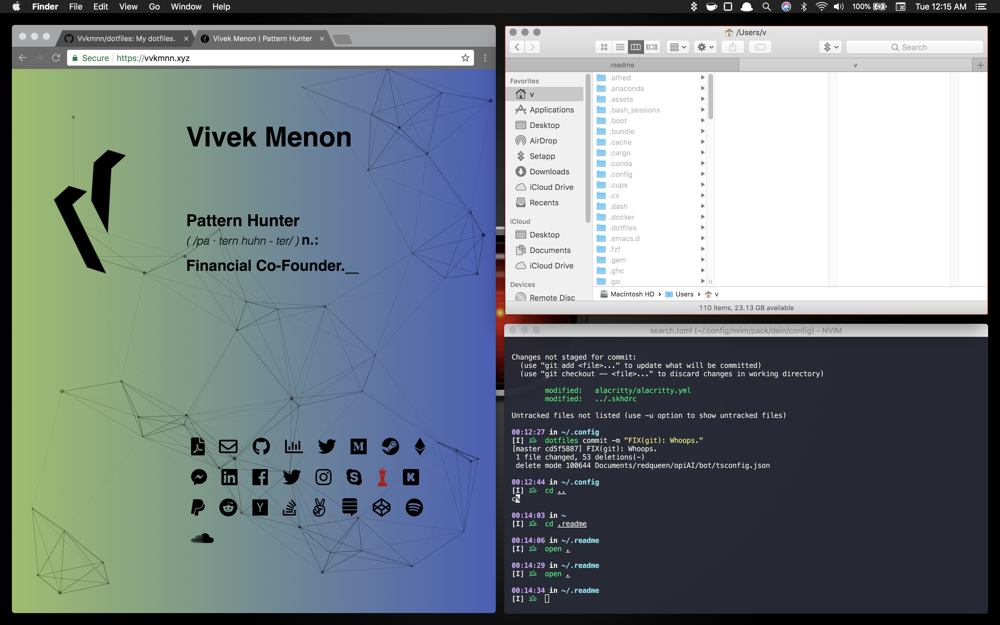

# dotfiles

```
##################################################
##################################################
######################        ####################
################                    ##############
#############                #######   ###########
###########                #########     #########
#########                 ########         #######
########                  ######            ######
#######                   ######             #####
######            ####### ######              ####
#####           ######### ######               ###
#####           #######   ######               ###
#####            ######    #####               ###
#####             ######    ####               ###
#####              ######    ###               ###
#####               ######    #                ###
######               ######                   ####
#######               #####                  #####
########               #####                ######
##########              #####             ########
############             #####          ##########
##############               ##       ############
##################                ################
##################################################
##################################################
```

[A](https://medium.com/@webprolific/getting-started-with-dotfiles-43c3602fd789) [dotfile](https://dotfiles.github.io) [repo](https://news.ycombinator.com/item?id=11070797).

## Screenshot



## Setup

``` sh
# debian
sudo apt get install git zsh curl
```

## Install

```sh
# ssh
ssh-keygen -t rsa -b 4096 -C "example@example.com"
cat ~/.ssh/id_rsa.pub

# github
alias dotfiles='/usr/bin/git --git-dir=$HOME/.dotfiles/ --work-tree=$HOME'
dotfiles stash
git clone --bare git@github.com:Vvkmnn/dotfiles.git --branch <device> $HOME/.dotfiles
dotfiles checkout

# optional
dotfiles config status.showUntrackedFiles no
```

## Post Install

```
# zsh
chsh -s $(which zsh)
zimfw update
```

## Setup`

```
# TODO guided
./.setup/setup.sh

# individual
chmod +x ./setup/<example>.sh
./.setup/<example>.sh

# core
vim.sh   # Editor
zsh.sh   # Shell
brave.sh # Browser
emacs.sh # IDE

# utility
capslock.sh
```

## Backup

```
cd
mkdir -p .backup && \
dotfiles checkout 2>&1 | egrep "\s+\." | awk {'print $1'} | \
xargs -I{} mv {} .backup/{}
```

## Update


``` sh
# combined
dotfiles submodule update --init --recursive

# create + update
dotfiles submodule init # Create all folders 
dotfiles submodule update # Update all folders to master branch
```

